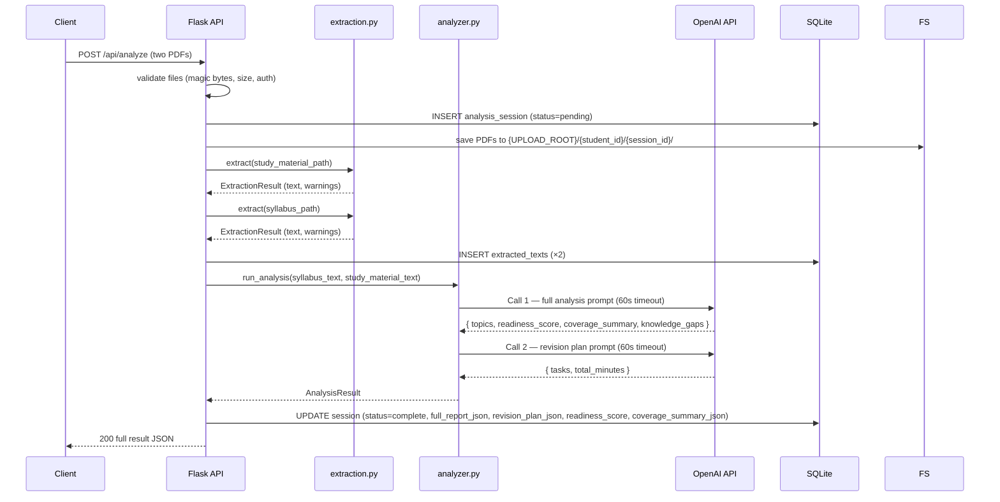

# Design Document — StudyLens AI (MVP)

## Overview

StudyLens AI is a web application that analyses a student's study material against their course syllabus and produces an exam-readiness report with a personalised revision plan. The student uploads two PDF files; the backend extracts text, runs a two-call AI analysis pipeline, and returns structured feedback through a responsive single-page interface.

MVP stack:
- **Backend**: Python 3.11 + Flask
- **Frontend**: Vanilla HTML/CSS/JavaScript (no framework, no build step)
- **Database**: SQLite via plain `sqlite3` (no ORM)
- **File storage**: Local filesystem, path-scoped per student and session
- **Text extraction**: `pdfplumber` for embedded text; `pytesseract` + `pdf2image` for OCR fallback
- **AI analysis**: Groq API (OpenAI-compatible) via `openai` SDK — 2 structured calls for the analysis pipeline, additional calls for the AI Study Tutor and secondary features. Provider configured via `GROQ_API_KEY` and `GROQ_MODEL` env vars.

The design is intentionally minimal: 6 database tables, 8 API endpoints for the core MVP, a synchronous pipeline, and no background workers. Every component is a plain Python module so future features (past-paper analysis, quizzes, flashcards, knowledge graph) can be added without restructuring the codebase.

---

## Architecture

### High-Level Component Diagram

```mermaid
graph TD
    Student([Student Browser])
    FE[Frontend\nVanilla JS SPA]
    API[Flask API Layer]
    AUTH[auth.py\nRegister · Login · JWT]
    EE[extraction.py\npdfplumber / pytesseract]
    AA[analyzer.py\n2-call AI pipeline]
    TT[tutor.py\nAI Study Tutor]
    DB[(SQLite\n6 tables)]
    FS[(File Storage\nLocal Filesystem)]
    AI[Groq API\n(OpenAI-compatible)]

    Student -->|HTTP| FE
    FE -->|REST/JSON| API
    API --> AUTH
    API --> EE
    API --> AA
    API --> TT
    AUTH --> DB
    EE --> FS
    EE --> DB
    AA --> DB
    TT --> DB
    AA -->|HTTPS| AI
    TT -->|HTTPS| AI
```

**Component responsibilities:**

| Component | File | Responsibility |
|---|---|---|
| Flask API Layer | `app.py` | Route registration, JWT middleware, error serialisation |
| Auth | `auth.py` | Registration, login, JWT issue/verify |
| Extraction Engine | `extraction.py` | PDF text extraction (direct + OCR) |
| AI Analyzer | `analyzer.py` | 2-call AI pipeline: analysis + revision plan |
| AI Study Tutor | `tutor.py` | Context-aware chat, quiz generation, viva mode |
| SQLite helpers | `db.py` | Connection, schema init, parameterised queries |
| Frontend | `static/` | Upload form, report rendering, session history |

---

## Components and Interfaces

### Auth (`auth.py`)

Handles registration and login. Passwords are hashed with bcrypt (work factor 12). JWTs are signed with HS256 using the `JWT_SECRET` environment variable.

- `register(email, password) -> None` — validates input, stores hashed password
- `login(email, password) -> str` — returns signed JWT on success
- `@require_auth` decorator — decodes Bearer token, injects `g.current_user`, returns 401 on failure or expiry

### Extraction Engine (`extraction.py`)

Stateless. Called by the analyze endpoint after files are saved.

- `extract(file_path: str) -> ExtractionResult` — returns `(text: str, char_count: int, warnings: list[str])`

Algorithm per PDF:
1. Reject if page count > 500.
2. Try `pdfplumber` on every page.
3. For any page yielding no text, apply `pytesseract` OCR via `pdf2image`.
4. Concatenate results. Track failed page count.
5. If all pages failed → raise `ExtractionError`.
6. If `char_count < 100` → append a low-content warning.

### AI Analyzer (`analyzer.py`)

Runs two sequential OpenAI Chat Completions calls. Each call uses a structured system prompt and expects a validated JSON response (via Pydantic). Responses are stored as JSON blobs directly in the session row.

**Call 1 — Full Analysis**

Sends both extracted texts (syllabus + study material) in a single prompt. Returns one structured JSON object containing:
- `topics`: list of `{title, importance, coverage_status, reasoning, key_gaps}`
- `readiness_score`: integer 0–100
- `coverage_summary`: `{total, covered, partially_covered, missing}`
- `knowledge_gaps`: ranked list of `{topic_title, importance, coverage_status, explanation, priority_tier}`

**Call 2 — Revision Plan**

Sends the `knowledge_gaps` from Call 1. Returns:
- `tasks`: ordered list of `{title, description, duration_minutes, gap_ref}`
- `total_minutes`: sum of all durations
- `maintenance_task`: included only when there are no gaps

Each call has a 60-second timeout. If the total pipeline exceeds 120 seconds, the session is marked failed.

---

### AI Study Tutor (`tutor.py`)

Handles context-aware chat, quiz generation, and viva mode. Called by the API layer after loading the session's analysis data from SQLite.

**Entry point:** `get_tutor_response(session_id, user_message, db) -> TutorResponse`

**Context building (no vector database required):**
1. Load `extracted_texts` for the session (syllabus + study material text)
2. Load `full_report_json` for topic coverage and knowledge gaps
3. Load last 10 tutor messages from `tutor_messages` for conversation history
4. Build a system prompt that includes:
   - The study material text (truncated to fit model context window)
   - The syllabus text
   - Topic coverage summary
   - Top 5 knowledge gaps
   - The revision plan summary
   - Instruction to stay grounded in the uploaded material
5. Send conversation history + user message to the Groq API

**Context window management:**
- Use `GROQ_MODEL` (default: `openai/gpt-oss-120b`) which has a 131K context window
- Truncate study material text to 40,000 characters if needed
- Truncate syllabus text to 10,000 characters if needed
- Include the most recent 10 exchanges from conversation history

**Quiz generation:** `generate_quiz(session_id, question_count, difficulty, question_type, db) -> QuizResult`
- Builds prompt from syllabus + study material, prioritising weak topics
- Returns structured JSON validated by a Pydantic `QuizModel`
- Stores result in `session_artifacts`

**Viva mode:** `start_viva(session_id, db) -> VivaQuestion` / `evaluate_viva_answer(session_id, answer, db) -> VivaFeedback`
- Generates questions from analysis, evaluates answers, stores transcript

---

## Data Models

### SQLite Schema (4 tables)

```sql
CREATE TABLE users (
    id           TEXT PRIMARY KEY,   -- UUID
    email        TEXT UNIQUE NOT NULL,
    password_hash TEXT NOT NULL,     -- bcrypt, never plaintext
    created_at   DATETIME NOT NULL DEFAULT CURRENT_TIMESTAMP
);

CREATE TABLE analysis_sessions (
    id                   TEXT PRIMARY KEY,  -- UUID
    student_id           TEXT NOT NULL REFERENCES users(id),
    course_name          TEXT,
    status               TEXT NOT NULL DEFAULT 'pending',
                         -- 'pending' | 'complete' | 'failed'
    failure_reason       TEXT,
    created_at           DATETIME NOT NULL DEFAULT CURRENT_TIMESTAMP,
    completed_at         DATETIME,
    readiness_score      INTEGER,           -- 0–100, NULL until complete
    coverage_summary_json TEXT,             -- {"total":N,"covered":N,...}
    full_report_json      TEXT,             -- complete analysis result from Call 1
    revision_plan_json    TEXT              -- revision plan result from Call 2
);

CREATE TABLE extracted_texts (
    id         TEXT PRIMARY KEY,
    session_id TEXT NOT NULL REFERENCES analysis_sessions(id),
    doc_type   TEXT NOT NULL,  -- 'study_material' | 'syllabus'
    content    TEXT NOT NULL,
    char_count INTEGER NOT NULL,
    warnings   TEXT            -- JSON array of warning strings
);

-- Reserved for future features (past papers, quizzes, flashcards, knowledge graph)
CREATE TABLE session_artifacts (
    id         TEXT PRIMARY KEY,
    session_id TEXT NOT NULL REFERENCES analysis_sessions(id),
    artifact_type TEXT NOT NULL,  -- e.g. 'past_paper', 'quiz', 'flashcard_set'
    payload_json  TEXT NOT NULL,
    created_at    DATETIME NOT NULL DEFAULT CURRENT_TIMESTAMP
);

-- Tutor conversation messages (per analysis session)
CREATE TABLE tutor_messages (
    id          TEXT PRIMARY KEY,
    session_id  TEXT NOT NULL REFERENCES analysis_sessions(id),
    role        TEXT NOT NULL,   -- 'user' | 'assistant'
    content     TEXT NOT NULL,
    created_at  DATETIME NOT NULL DEFAULT CURRENT_TIMESTAMP
);
```

No ORM. All queries use `sqlite3` with parameterised placeholders (`?`). `db.py` exposes `get_db()` (returns a connection with `row_factory = sqlite3.Row`) and `init_db()` (runs `CREATE TABLE IF NOT EXISTS`).

**Relationship map:**

```
User ──< AnalysisSession ──1 ExtractedText (×2)
                          ──1 ReadinessReport (in full_report_json column)
                          ──1 RevisionPlan (in revision_plan_json column)
                          ──< TutorMessage
                          ──< SessionArtifact  (quiz, viva, past_paper, knowledge_map)
```

---

## API Design

Five endpoints. All responses are JSON. Errors follow `{"error": "<human-readable message>"}`.

### Authentication

```
POST /auth/register
Body: { "email": string, "password": string }
201 Created: { "message": "Account created" }
400 Bad Request: invalid email format or password outside 8–128 chars
409 Conflict: email already registered

POST /auth/login
Body: { "email": string, "password": string }
200 OK: { "token": "<JWT>", "expires_at": "<ISO 8601>" }
401 Unauthorized: invalid credentials
```

JWT payload: `{ "sub": "<user_id>", "iat": <unix>, "exp": <iat + 86400> }`  
Algorithm: HS256. Secret: `JWT_SECRET` env var.

### Analyze (main endpoint)

```
POST /api/analyze
Headers: Authorization: Bearer <token>
Body: multipart/form-data
  study_material: <PDF file>
  syllabus: <PDF file>
  course_name: <string, optional>

200 OK: {
  "session_id": string,
  "readiness_score": integer,
  "coverage_summary": { "total": N, "covered": N, "partially_covered": N, "missing": N },
  "topics": [ { "title", "importance", "coverage_status", "reasoning", "key_gaps" }, ... ],
  "knowledge_gaps": [ { "topic_title", "importance", "coverage_status", "explanation", "priority_tier" }, ... ],
  "revision_plan": { "tasks": [...], "total_minutes": N }
}

400 Bad Request: missing file field(s)
401 Unauthorized: missing/invalid/expired token
413 Payload Too Large: file > 20 MB
415 Unsupported Media Type: file is not a PDF
429 Too Many Requests: ≥ 5 concurrent in-progress sessions
500 Internal Server Error: extraction failure or AI pipeline failure
```

The pipeline runs synchronously within this request. Flask's request timeout is set to 120 seconds via gunicorn's `--timeout 120`. No polling needed — the full result is in the response.

**Simplified status model**: sessions have three states only — `pending` (created, pipeline running), `complete`, `failed`. The intermediate `extracting`/`analyzing` states are dropped.

### Session Management

```
GET /api/sessions
Headers: Authorization: Bearer <token>

200 OK: {
  "sessions": [
    {
      "id": string,
      "course_name": string | null,
      "created_at": string,
      "status": string,
      "readiness_score": integer | null,
      "coverage_summary": { ... } | null
    },
    ...  // max 100 items, descending by created_at
  ]
}

GET /api/sessions/<session_id>
Headers: Authorization: Bearer <token>

200 OK: { "session": {...}, "full_report": {...} | null, "revision_plan": {...} | null }
403 Forbidden: session belongs to another student
404 Not Found: session does not exist
```

---

### AI Study Tutor

```
POST /api/sessions/<session_id>/tutor
Headers: Authorization: Bearer <token>
Body: { "message": string }

200 OK: {
  "response": string,
  "session_id": string,
  "message_id": string
}
400 Bad Request: missing or empty message
401 Unauthorized: missing/invalid/expired token
403 Forbidden: session belongs to another student
404 Not Found: session not found or not complete
408 Request Timeout: AI service did not respond within 60 s
500 Internal Server Error: AI service error

GET /api/sessions/<session_id>/tutor/history
Headers: Authorization: Bearer <token>

200 OK: {
  "messages": [
    { "id": string, "role": "user"|"assistant", "content": string, "created_at": string },
    ...
  ]
}
```

### Secondary Features (Quiz, Viva, Past Paper)

```
POST /api/sessions/<session_id>/quiz
Headers: Authorization: Bearer <token>
Body: { "question_count": 1-20, "difficulty": "easy"|"medium"|"hard", "question_type": "mcq"|"short_answer" }

200 OK: { "artifact_id": string, "quiz": { "questions": [...] } }

POST /api/sessions/<session_id>/viva/start
POST /api/sessions/<session_id>/viva/answer
Body: { "answer": string }

POST /api/sessions/<session_id>/past-paper
Body: multipart/form-data — past_paper: <PDF file>

GET /api/sessions/<session_id>/artifacts
Returns list of all stored artifacts for the session
```

---

## Analysis Pipeline Flow



**Failure path**: if extraction raises or either AI call fails/times out, the session is updated to `status=failed` with a `failure_reason` string and the endpoint returns 500. Any data stored before the failure (e.g. extracted texts) is retained in the database.

---

## Frontend Architecture

### Page Structure

Single `index.html` with ES module scripts. No build step required.

```
index.html
├── #nav          — logo, login/register toggle, history link
├── #auth-panel   — register/login forms (hidden when authenticated)
├── #upload-panel — two-file upload form (shown when authenticated)
├── #progress-panel — loading spinner (shown during analysis)
├── #report-panel — readiness score, topic table, gap list, revision plan
└── #history-panel — session list with score badges

static/
├── css/
│   ├── base.css        — reset, CSS variables, typography
│   ├── layout.css      — responsive grid, breakpoints 375/768/1280px
│   └── components.css  — cards, badges, tables, alerts
└── js/
    ├── api.js          — fetch wrapper, JWT attachment, error normalisation
    ├── auth.js         — register/login/logout, token in sessionStorage
    ├── upload.js       — file validation, submit, show/hide progress
    ├── report.js       — render readiness score, topic table, gap list
    ├── revisionPlan.js — render revision tasks and total time
    └── history.js      — fetch and render session history
```

No `state.js`. State is kept in plain module-level variables inside each module. Modules communicate by calling each other's exported functions directly. No reactive store, no custom events for state changes.

### Client-Side Validation

Before the upload request is sent:
1. Both file inputs must have a selected file — show a field-specific error if absent.
2. Each file's `type` must be `application/pdf` — show an error identifying the offending file.
3. Each file's `size` must be ≤ 20 971 520 bytes (20 MiB) — show an error with the size limit.

The submit button is disabled on page load. It is re-enabled only when both files pass validation, then disabled again immediately on submit and kept disabled until the response arrives. The loading spinner appears within 300 ms (triggered synchronously in the click handler before the async fetch).

### Responsive Layout

Three breakpoints via CSS custom properties:

| Breakpoint | Layout |
|---|---|
| `≤ 375px` | Single column, stacked sections |
| `768px` | Two-column (form + status side-by-side) |
| `1280px` | Three-column (nav + main + history sidebar) |

All interactive elements have `min-height: 44px` for touch targets. No horizontal overflow at any breakpoint.

### WCAG 2.1 AA

- Colour palette chosen to meet 4.5:1 contrast ratio for normal text and 3:1 for large text and UI components.
- All interactive elements have visible focus rings.
- Form inputs and buttons have `<label>` elements or `aria-label` attributes.
- Error and status messages are in `role="status"` live regions.

> Full WCAG validation requires manual testing with assistive technologies and expert accessibility review beyond automated tooling.

### New Frontend Panels

**`#tutor-panel`** — AI Study Tutor chat interface
- Chat message list (scrollable)
- Message input with send button
- Suggested prompts: "Explain this", "Simplify", "Give an example", "What should I study next?"
- Rendered by `tutor.js`

**`#dashboard-panel`** — Student Progress Dashboard (replaces or augments `#history-panel`)
- Most recent readiness score
- Recent session cards (up to 5)
- Quick link to AI Tutor for most recent session
- Revision plan summary

**Secondary panels (deferred):**
- `#quiz-panel` — quiz questions and answer submission
- `#viva-panel` — viva mode conversation
- `#knowledge-map-panel` — interactive concept graph

### New JS Modules

| Module | Responsibility |
|---|---|
| `tutor.js` | Send/receive tutor messages, render chat, load history |
| `dashboard.js` | Render dashboard panel, link to tutor |
| `quiz.js` (secondary) | Request and render quiz questions, submit answers |
| `viva.js` (secondary) | Start viva session, submit answers, render feedback |
| `knowledgeMap.js` (secondary) | Render knowledge map nodes using lightweight SVG/canvas |

---

## Security Design

### Password Hashing

bcrypt with work factor 12 via `flask-bcrypt`. Plaintext password is never logged, stored, or returned. The `password_hash` column is never included in any API response.

### JWT

- Algorithm: HS256, expiry 24 hours
- Secret: `JWT_SECRET` env var — Flask startup fails if unset
- Transmitted only in the `Authorization: Bearer` header over HTTPS
- Frontend stores the token in `sessionStorage` (cleared on tab close)

### File Path Isolation

Files are stored at:
```
{UPLOAD_ROOT}/{student_id}/{session_id}/study_material.pdf
{UPLOAD_ROOT}/{student_id}/{session_id}/syllabus.pdf
```

Paths are constructed using `pathlib.Path` with explicit components. Path traversal is prevented by asserting the resolved path is a strict child of `UPLOAD_ROOT` before any write or read.

### PDF Validation

MIME type is validated by reading the first 4 bytes of the uploaded file and checking for the `%PDF` magic signature — no `python-magic` dependency required. Size is checked against 20 MiB before the file is written to disk.

### Database Safety

All queries use `sqlite3` parameterised placeholders (`?`). No raw SQL string concatenation.

### Concurrency Limit

Before creating a new session, count `WHERE student_id = ? AND status = 'pending'`. If ≥ 5, return 429.

---

## Error Handling

Six error types covering the full HTTP surface:

| Situation | HTTP Status | Response body |
|---|---|---|
| Invalid input (email, password, missing fields) | 400 | `{"error": "<description>"}` |
| Not authenticated / expired token | 401 | `{"error": "Authentication required"}` |
| Session belongs to another student | 403 | `{"error": "Not found"}` (intentionally vague) |
| Session or resource not found | 404 | `{"error": "Not found"}` |
| Unsupported file type | 415 | `{"error": "Only PDF files are accepted"}` |
| File too large | 413 | `{"error": "File exceeds the 20 MB limit"}` |
| Duplicate email on registration | 409 | `{"error": "Email already registered"}` |
| Too many concurrent sessions | 429 | `{"error": "Maximum of 5 concurrent sessions reached"}` |
| Extraction or AI pipeline failure | 500 | `{"error": "<stage-specific message>"}` |
| AI tutor did not respond within 60 s (`TUTOR_TIMEOUT`) | 408 | `{"error": "AI tutor request timed out"}` |
| Session context could not be loaded for tutor (`TUTOR_CONTEXT_ERROR`) | 500 | `{"error": "Could not load session context for tutor"}` |
| Artifact limit (10) per session reached (`ARTIFACT_LIMIT`) | 429 | `{"error": "Artifact limit reached for this session"}` |
| Tutor message limit (100) per session reached (`MESSAGE_LIMIT`) | 429 | `{"error": "Message limit reached for this session"}` |

**Pipeline failure handling:**
- The session row is updated to `status=failed` with a `failure_reason` before the 500 is returned.
- Previously stored data (extracted texts) is never deleted on failure.
- The frontend reads the `error` field and displays it in a visible error container. Raw HTTP status codes, exception class names, and stack traces are never shown to the student.

---

## Correctness Properties

*A property is a characteristic or behavior that should hold true across all valid executions of a system — essentially, a formal statement about what the system should do. Properties serve as the bridge between human-readable specifications and machine-verifiable correctness guarantees.*

### Property 1: Readiness Score Formula

*For any* completed Analysis Session with `T` total topics and `C` topics with coverage status `covered`, the stored `readiness_score` SHALL equal `round((C / T) * 100)`.

**Validates: Requirements 7.2**

---

### Property 2: Coverage Counts Sum to Total

*For any* coverage summary produced by the AI Analyzer, `covered + partially_covered + missing` SHALL equal `total`.

**Validates: Requirements 5.5**

---

### Property 3: Knowledge Gaps Follow the Six-Tier Priority Order

*For any* Knowledge Gap list, no gap at a lower priority tier SHALL appear before a gap at a higher priority tier. Tier order (highest to lowest): (1) missing + high, (2) missing + medium, (3) missing + low, (4) partially_covered + high, (5) partially_covered + medium, (6) partially_covered + low.

**Validates: Requirements 6.2, 8.2**

---

### Property 4: Revision Plan Total Equals Sum of Task Durations

*For any* Revision Plan, the `total_minutes` field SHALL equal the sum of `duration_minutes` across all revision tasks in that plan.

**Validates: Requirements 8.5**

---

### Property 5: Passwords Are Never Stored in Plaintext

*For any* successful registration, the value stored in `password_hash` SHALL NOT equal the submitted plaintext password and SHALL be a valid bcrypt hash (prefix `$2b$`).

**Validates: Requirements 1.5**

---

### Property 6: Cross-Student Session Access Returns 403

*For any* Analysis Session owned by student A, an authenticated request by student B for that session's identifier SHALL return HTTP 403, regardless of whether the session exists or its content.

**Validates: Requirements 9.4**

---

### Property 34: Tutor Response Never Modifies the Parent Analysis Session

*For any* tutor message request that succeeds or fails, the `full_report_json`, `revision_plan_json`, `readiness_score`, and `coverage_summary_json` columns of the parent `analysis_sessions` row SHALL remain unchanged after the request.

**Validates: Requirements 18.2**

---

### Property 35: Tutor Message Limit Enforced

*For any* authenticated student who already has 100 or more TutorMessage rows for a given session, a new tutor message request for that session SHALL return HTTP 429 without storing a new message.

**Validates: Requirements 18.4**

---

## Testing Strategy

### Approach

Two complementary layers:
- **pytest unit tests** — specific examples, boundary values, and error conditions
- **Hypothesis property tests** — the six correctness properties above, each run with at least 100 generated examples

No integration test suite is required for the MVP. A single end-to-end smoke test (real small PDFs, mocked OpenAI) is sufficient to verify the wiring.

### Property-Based Tests (Hypothesis)

```python
from hypothesis import given, settings, strategies as st
from analyzer import compute_readiness_score, rank_knowledge_gaps, build_revision_plan

# Feature: studylens-ai, Property 1: Readiness Score formula is always correct
@given(
    total=st.integers(min_value=1, max_value=200),
    covered=st.integers(min_value=0, max_value=200),
)
@settings(max_examples=100)
def test_readiness_score_formula(total, covered):
    covered = min(covered, total)
    expected = round((covered / total) * 100)
    assert compute_readiness_score(covered, total) == expected


# Feature: studylens-ai, Property 2: Coverage counts sum to total
@given(st.lists(
    st.sampled_from(["covered", "partially_covered", "missing"]),
    min_size=1, max_size=200
))
@settings(max_examples=100)
def test_coverage_counts_sum(statuses):
    summary = build_coverage_summary(statuses)
    assert summary["covered"] + summary["partially_covered"] + summary["missing"] == summary["total"]


# Feature: studylens-ai, Property 3: Gap ranking follows six-tier order
@given(st.lists(gap_strategy(), min_size=1, max_size=50))
@settings(max_examples=100)
def test_gap_ranking_order(gaps):
    ranked = rank_knowledge_gaps(gaps)
    for i in range(len(ranked) - 1):
        assert priority_tier(ranked[i]) <= priority_tier(ranked[i + 1])


# Feature: studylens-ai, Property 4: Revision plan total equals sum of task durations
@given(st.lists(task_strategy(), min_size=0, max_size=200))
@settings(max_examples=100)
def test_revision_plan_total(tasks):
    plan = build_revision_plan(tasks)
    assert plan["total_minutes"] == sum(t["duration_minutes"] for t in tasks)
```

Properties 5 and 6 are verified by unit tests (bcrypt hash inspection and an HTTP-level session ownership check) rather than Hypothesis, since their input spaces are small and well-defined.

### Unit Test Focus Areas

- Registration: duplicate email (409), password at boundaries (7, 8, 128, 129 chars), malformed email formats
- Login: correct credentials return a JWT with valid `exp`; wrong credentials return 401
- File upload: missing field, non-PDF magic bytes, file exactly at and one byte above 20 MiB
- Extraction: embedded-text path, OCR path, mixed path, all-pages-failed error, < 100 char warning, > 500 page rejection
- Analyzer: mocked Call 1 and Call 2 responses; timeout on Call 1 marks session failed; invalid JSON from AI raises a parse error
- Session endpoints: correct descending order, 100-item cap, 403 on cross-student access, 404 for unknown session

---

## Deployment

### Render (Free Tier)

The MVP deploys as a single web service on [Render](https://render.com).

**Service type**: Web Service  
**Runtime**: Python 3.11  
**Build command**: `pip install -r requirements.txt`  
**Start command**: `gunicorn app:app --timeout 120 --workers 1 --bind 0.0.0.0:$PORT`

**Persistent storage**: Attach a Render Disk (1 GB free tier) mounted at `/data`. Set `UPLOAD_ROOT=/data/uploads` and `DATABASE_URL=/data/studylens.db`.

**Environment variables** (set in Render dashboard):
```
JWT_SECRET=<random 64-char hex string>
GROQ_API_KEY=<your Groq key>
GROQ_MODEL=openai/gpt-oss-120b
UPLOAD_ROOT=/data/uploads
DATABASE_URL=/data/studylens.db
FLASK_ENV=production
```

**SQLite note**: Render's free disk is single-instance and persistent across deploys. This is sufficient for an MVP. If traffic grows, swap SQLite for Render's managed PostgreSQL (single config change in `db.py`).

**Tesseract for OCR**: Add a `render.yaml` or use a `Dockerfile` base image that includes `tesseract-ocr`. The simplest approach:

```dockerfile
FROM python:3.11-slim
RUN apt-get update && apt-get install -y tesseract-ocr poppler-utils && rm -rf /var/lib/apt/lists/*
COPY . /app
WORKDIR /app
RUN pip install -r requirements.txt
CMD ["gunicorn", "app:app", "--timeout", "120", "--workers", "1", "--bind", "0.0.0.0:$PORT"]
```

**Alternative free-tier hosts**: Railway and Fly.io support the same Dockerfile with equivalent environment variable configuration.

---

## Extensibility Notes

The modular file structure makes future features straightforward additions:

| Future feature | New module | Hook point |
|---|---|---|
| Past-paper analysis | `past_paper.py` or `tutor.py` | `POST /api/sessions/<id>/past-paper`, stores in `session_artifacts` with adjusted priorities |
| Auto-generated quizzes | `tutor.py` | `POST /api/sessions/<id>/quiz`, stores in `session_artifacts` |
| Flashcard generation | `flashcards.py` | Fourth AI call, result in `session_artifacts` |
| Viva/interview questions | `tutor.py` | `POST /api/sessions/<id>/viva/start`, stores transcript in `session_artifacts` |
| Interactive knowledge graph | `tutor.py` or `analyzer.py` | `GET /api/sessions/<id>/artifacts`, stores node/edge JSON in `session_artifacts` |

The `session_artifacts` table is already in the schema to hold arbitrary JSON payloads per session without schema migrations.
